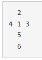

# 백준 14499 : 주사위 굴리기

## 문제 설명

크기가 N * M인 지도가 존재하고, 지도에서 좌표 표현은 (r, c)로 한다.  
이때 r은 북쪽으로부터 떨어진 칸의 개수, c는 서쪽으로 떨어진 칸의 개수이다.  
주사위의 전개도는 아래와 같다  

  
주사위의 윗 면은 1이고, 오른쪽 면은 3이며, 놓여진 곳의 좌표는 (x, y)이다.  
처음에는 모든 면이 0이 적혀있지만, 주사위가 이동함에 따라 달라진다.   
- 이동한 칸에 쓰여있는 수가 0일때, **주사위의 바닥면에 쓰여 있는 수가 칸에 복사된다.**
- 이동한 칸에 쓰여있는 수가 0이 아닐때, **칸에 쓰여있는 수가 주사위 바닥면으로 복사되며, 칸에 쓰여있는 수는 0이 된다.**  

## 예시

1) 예제 입력 1

- 지도크기 및 주사위 좌표와 명령어 개수  

|N|M|X|Y| K   |
|---|---|---|---|-----|
|4|2|0|0| 8   |  

- 지도  

| 0    | M(0) | M(1) |
|------|------|------|
| N(0) |0|2| 
| N(1) |3|4|
| N(2) |5|6|
| N(3) |7|8|

- 명령

|1|2|3|4|5|6|7|8|
|---|---|---|---|---|---|---|---|
|4|4|4|1|3|3|3|2|

- 명령에 따른 이동

|동|서|북|남|
|---|---|---|---|
|1|2|3|4|

1) 4 -> 남

> (x, y) = 0, 1  
> 윗면 -> 0

| 0    | M(0) | M(1) |
|------|------|------|
| N(0) |0|2| 
| N(1) |0|4|
| N(2) |5|6|
| N(3) |7|8|

| | | |
|---|---|---|
| |0| |
|0|0|0|
| |0| |
| |3| |

2) 4 -> 남

> (x, y) = 0, 2 
> 윗면 -> 0

| 0    | M(0) | M(1) |
|------|------|------|
| N(0) |0|2| 
| N(1) |0|4|
| N(2) |0|6|
| N(3) |7|8|

| | | |
|---|---|---|
| |3| |
|0|0|0|
| |0| |
| |5| |

3) 4 -> 남

> (x, y) = 0, 3  
> 윗면 -> 3

| 0    | M(0) | M(1) |
|------|------|------|
| N(0) |0|2| 
| N(1) |0|4|
| N(2) |0|6|
| N(3) |0|8|

| | | |
|---|---|---|
| |5| |
|0|3|0|
| |0| |
| |7| |

4) 1 -> 동

> (x, y) = 1, 3

| 0    | M(0) | M(1) |
|------|------|------|
| N(0) |0|2| 
| N(1) |0|4|
| N(2) |0|6|
| N(3) |0|8|

5) 3 -> 북

> (x, y) = 1, 0

6) 3 -> 북

> (x, y) = 1, 0

7) 3 -> 북

> (x, y) = 1, 0

8) 2 -> 서

> (x, y) = 0, 0